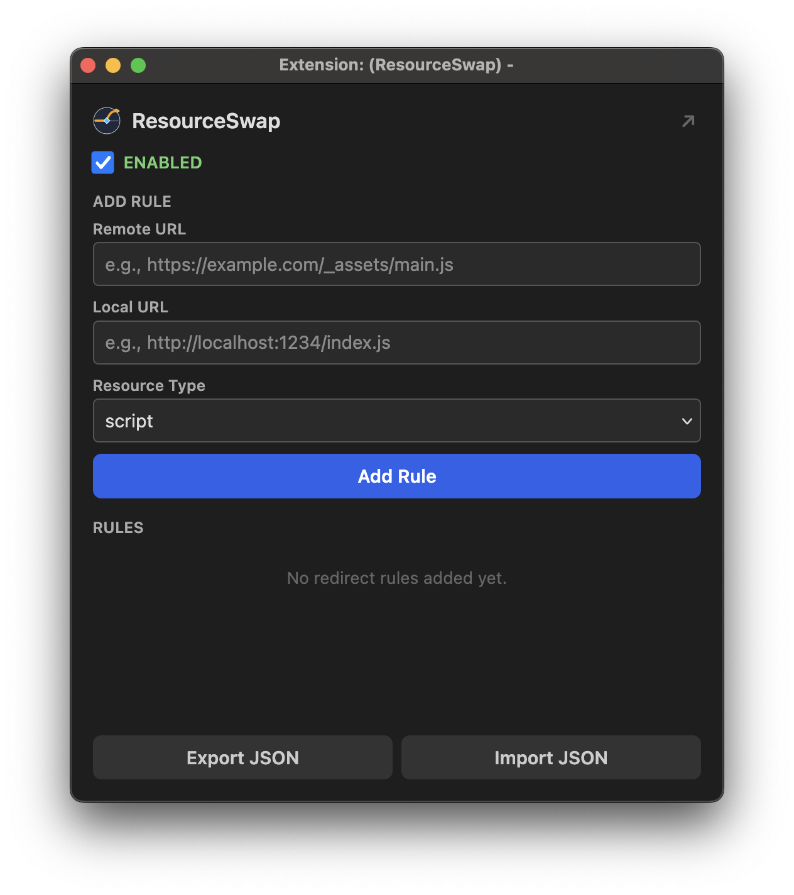

# ResourceSwap

A browser extension (Chrome + Firefox) that intercepts network requests for production JS, CSS, and other resources and redirects them to a local development server. Test local code changes against a live production environment without modifying the production server.



## Features

- Redirect any resource type (scripts, stylesheets, XHR/fetch, images, fonts, media)
- Per-rule enable/disable toggles
- Global on/off switch
- Automatic CORS header injection for localhost responses
- Import/export rules as JSON
- Dark mode support
- Pop-out window mode (useful in Firefox where popups close on blur)

## Building

Run the build script to produce browser-specific builds:

```sh
./build.sh
```

This copies shared source files from `src/` into `dist/chrome/` and `dist/firefox/`, each with the appropriate `manifest.json`, and produces store-ready archives (`dist/resourceswap-chrome-<version>.zip` and `dist/resourceswap-firefox-<version>.zip`) with `manifest.json` at the archive root.

## Installation

### Chrome

1. Navigate to `chrome://extensions`.
2. Enable **Developer mode** (toggle in the top-right corner).
3. Click **Load unpacked** and select the `dist/chrome/` folder.

### Firefox

1. Navigate to `about:debugging#/runtime/this-firefox`.
2. Click **Load Temporary Add-on**.
3. Select `dist/firefox/manifest.json`.

## Project Structure

```
src/
  background.js           Background service worker / script
  scripts.js              Popup UI logic
  index.html              Popup markup
  style.css               Popup styles (light + dark mode)
  manifest.chrome.json    Chrome manifest (MV3, service_worker)
  manifest.firefox.json   Firefox manifest (MV3, background scripts)
  icons/                  Extension icons (SVG source + generated PNGs)
build.sh                  Builds dist/{chrome,firefox} and store-ready zips
dist/                     Build output (gitignored)
```

## License

This project is dual-licensed under either of

- MIT license ([LICENSE-MIT](LICENSE-MIT) or <https://opensource.org/licenses/MIT>)
- Mozilla Public License, Version 2.0 ([LICENSE-MPL-2.0](LICENSE-MPL-2.0) or <https://www.mozilla.org/MPL/2.0/>)

at your option. `SPDX-License-Identifier: MIT OR MPL-2.0`

Unless you explicitly state otherwise, any contribution intentionally submitted for inclusion in this project by you shall be dual-licensed as above, without any additional terms or conditions.
